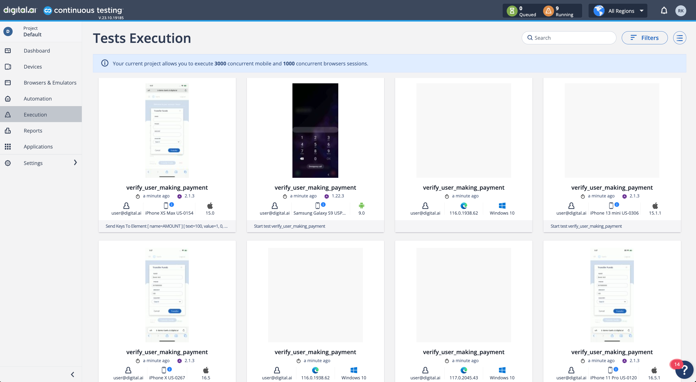

## CT-StoryBoardDemo

### Background

This Framework is designed to run Automated Appium & Selenium Tests against Digital.ai's Continuous Testing [Banking Mobile Application](https://demo-bank.ct.digital.ai/login).

### Technologies Used

```Programming Language```: Java

```Test Automation Framework```: Selenium / Appium

```Compiler Option```: Maven

```Test Runner```: TestNG

### Test Setup

#### Dependencies

Install TestNG and Maven Plugin from the IntelliJ Market Place (_If you don't have them already_). This will simplify running the Automated Tests.

#### Authentication

Provide **Cloud URL** and **Access Key** in ```config.properties``` file.

[Obtaining your Access Key](https://docs.digital.ai/bundle/TE/page/obtaining_access_key.html).

#### XML File Generation

This Test Automation Framework is designed to be able to run Automated Tests at scale. XML files are used as it offers an easy way to run automated tests at scale, natively provided by TestNG.

To start creating XML Files, follow these steps:

1. Go to the **CreateXmlFiles.java** under **test/java/tests/** folder
2. There are 4 Methods:

```agsl
web_xml_file_for_smoke()
mobile_xml_file_for_smoke()
web_xml_file_for_regression()
mobile_xml_file_for_regression()
```

Each method uses a common helper method, ```create_xml_file()``` which accepts 4 parameters.

Parameter 1

| Name | Type   | Description |
|------|--------|-------------|
| type | String | Provide "web" or "mobile" |

Parameter 2

| Name        | Type | Description                                                  |
|-------------|------|--------------------------------------------------------------|
| threadCount | int   | A number for total number of test classes you want to invoke |


Parameter 3

| Name        | Type   | Description                      |
|-------------|--------|----------------------------------|
| xmlFileName | String | anyString.xml - ".xml" is a must |


Parameter 4

| Name      | Type   | Description                                                                                          |
|-----------|--------|------------------------------------------------------------------------------------------------------|
| suiteName | String | Any String to define the type of suite. This is added to CT Reporter later for Test Report Filtering |


### Test Execution

From your Terminal window, you can run Automated Tests in two ways (_Currently, the framework supports running either 1 or 2 XMLs concurrently_):

```mvn clean test -DxmlFile=yourXmlFile.xml``` - Runs all tests from one .xml file

```mvn clean test -DxmlFile=yourXmlFile1.xml,yourXmlFile2.xml``` - Runs all tests from two .xml files

This should trigger Automation Tests against the configured Cloud in config.properties:

